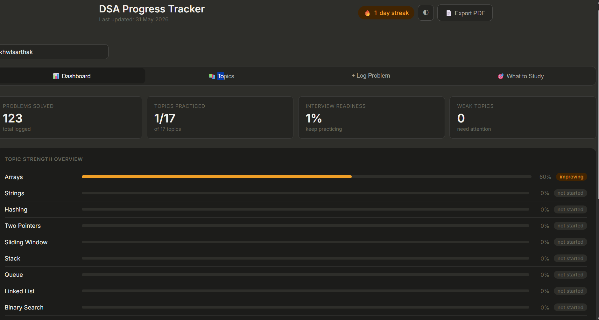
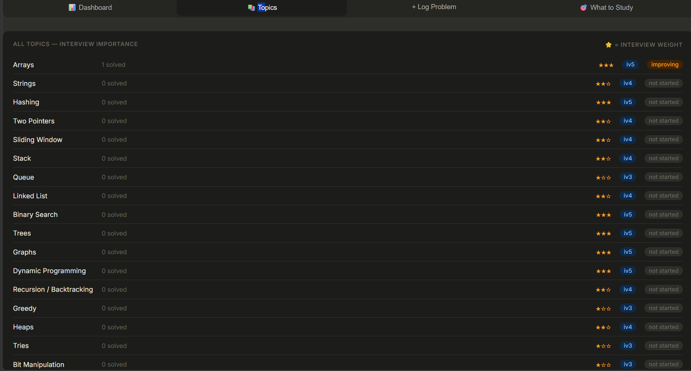

# DSA Progress Tracker

A full-stack DSA tracking application that helps monitor problem-solving progress, topic mastery, interview readiness, and weak areas.

## Features

- Track solved DSA problems
- Topic-wise progress analysis
- Interview readiness score
- Weak topic detection
- Dark mode support
- LeetCode integration
- Local storage persistence

## Tech Stack

- HTML
- CSS
- JavaScript
- Node.js
- Express.js
- Git & GitHub

## Dashboard

## Topics Analysis

